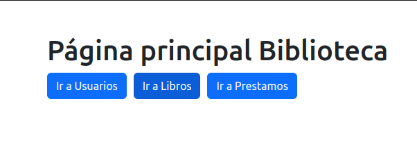
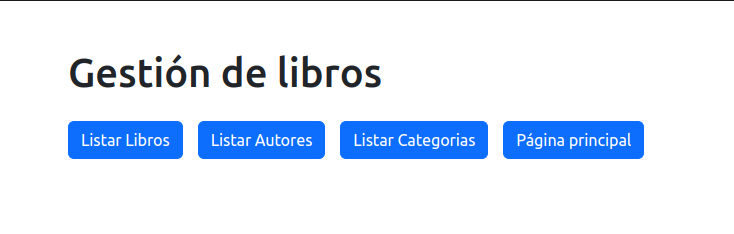

## Proyecto Coderhouse para gestión de biblioteca
### Comisión: 54135
#### Alumno: Julio Grecco

Para probar la funcionalidad usar la opción de **Ir a Libros** según la captura:

La funcionalidad disponible para probar es la que se encuentra en el siguiente menú:

La vista de usuarios simplemente muestra los usuarios cargados en la base de datos actualmente.

#### Acerca del proyecto
Una gestión de una biblioteca incluyendo base de datos de libros, de usuarios y el registro y gestión de préstamos.
#### Aplicaciones
* Usuarios: Gestión de usuarios, tanto bibliotecarios como lectores.
* Libros: Base de datos de libros, autores y prestamos con tablas relacionadas.
* Préstamos: Gestión de préstamos de libros relacionando las bases de datos de usuarios y libros
##### Modelos
Los modelos según aplicación son los siguientes:

* App usuarios:
    * Persona
        nombre
         mail
    * Rol
        nombre
    * Usuario
        name
        pw
        rol

* App libros:
    * Autor
        nombre
        descripcion
    * Categoria
        nombre
        descripcion
    * Libro
        nombre
        autor
        categoria
        stock
        existencia
* App prestamos
    * Prestamo
        fechaalta
        usuario
        libro

#### Mejoras futuras

Desarrollar el ingreso de libros nuevos usando las tablas relacionadas
Desarrollar el sistema de gestión e ingreso de préstamos en la base de datos (CRUD)
Desarrollar la gestión de usuarios (CRUD)

#### Problemas conocidos
En las vistas que son resultado de una búsqueda falta un botón para volver a listar toda la base de datos
Al editar o eliminar un registro en libros, autores o categorias no vuelve a la pantalla inmediatamente anterior