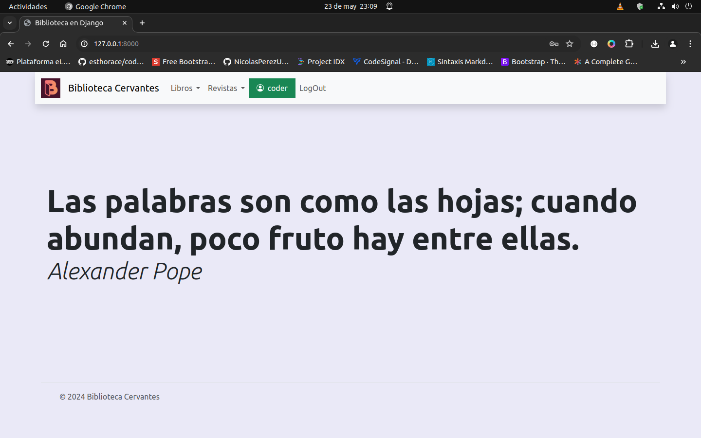
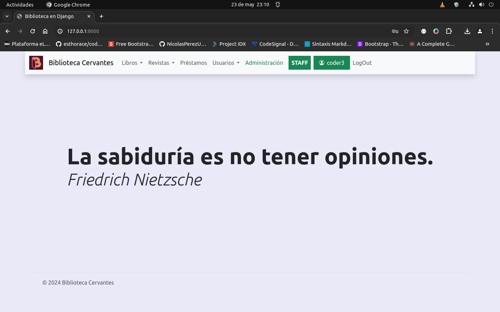

## Proyecto Coderhouse para gestión de una biblioteca
### Comisión: 54135
#### Alumno: Julio Grecco
_________________________________________
##### Usuarios de prueba:
Puede usarse para probar los siguientes usuarios:
 * usr: coder
 pw: biblioteca

 * usr: coder2 (usuario staff)
 pw: biblioteca
 
 * usr: coder3 (usuario staff admministrador)
 pw biblioteca
 

#### Acerca del proyecto
El proyecto consiste en un aplicación para gestión de una biblioteca incluyendo base de datos de libros, de usuarios y el registro de préstamos de libros.

#### Aplicaciones
* Usuarios: Gestión de usuarios, tanto bibliotecarios como lectores, tomando como base los usuarios del sistema. Hay usuarios, hay usuarios parte del staff y también usuarios parte del staff superusuario. La aplicación muestra opciones diferentes en cada caso.

* Libros: Base de datos de libros, autores y géneros literarios con tablas relacionadas usando una FK.

* Préstamos: Gestión de préstamos de libros relacionando las bases de datos de usuarios y libros.

* Utilidad: En la carpeta jsons están los archivos json y el código python usado para llenar la base de datos con información de libros, autores y géneros literarios.

##### Modelos
Los modelos según aplicación son los siguientes:

* App usuarios:
    
    * Rol
        nombre
        descripcion

    * Usuario
        usuario
        mail
        rol
        avatar

* App libros:
    * Autor
        nombre
        nacionalidad
        descripcion

    * Genero
        nombre
        descripcion

    * Editorial
        nombre
        pais

    * Libro
        titulo
        autor
        editorial
        genero
        isbn
        anio
        descripcion
        idioma
        paginas
        stock
        existencia

* App prestamos
    * Prestamo
        fechaAlta
        usuario
        libro

#### Mejoras futuras

Desarrollar el módulo de revistas siguiendo el modelo usado para el de libros.
Desarrollar el sistema de gestión usuarios permitiendo la baja de usuarios pero monitoreando que el usuario no tenga un préstamo vigente (CRUD)
Desarrollar la gestión de prestamos evitando borrarlos y pasando el generando un estado que indique si está completo o en curso y llevando un contról de libros prestados por usuario. Esto permitiría que el usuario lector al ingresar pueda ver qué libros se llevó  (CRUD)

#### Problemas conocidos
Problemas varios en el frontend ej. las tarjetas de libros son demasiado grandes y debiera mostrar información completa a requerimiento y no todo el tiempo. El mismo principio para las vistas de autores y géneros literarios. Además el logín/logout se podría resolver con un modal y no con un redireccionamiento a otra página.
